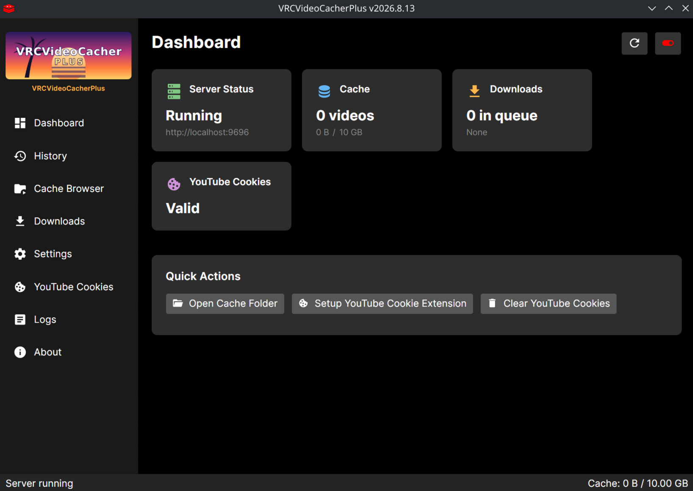

# VRCVideoCacherPlusPlus

**Language:** **English** | [日本語](./README_ja-JP.md) | [Magyar](./README_hu-HU.md) | [한국어](./README_ko-KR.md) | [Português do Brasil](./README_pt-BR.md)

### Download

- [Windows — VRCVideoCacher.exe](https://github.com/Bluscream/VRCVideoCacherPlusPlus/releases/latest/download/VRCVideoCacher.exe)
- [Linux — VRCVideoCacher](https://github.com/Bluscream/VRCVideoCacherPlusPlus/releases/latest/download/VRCVideoCacher)

**Install the original VRCVideoCacher cookie extension** (default — use these):
- [Chrome Extension](https://chromewebstore.google.com/detail/vrcvideocacher-cookies-ex/kfgelknbegappcajiflgfbjbdpbpokge)
- [Firefox Extension](https://addons.mozilla.org/en-US/firefox/addon/vrcvideocachercookiesexporter)

The VRCVideoCacherPlusPlus extensions ([BrowserExtension/](BrowserExtension/)) support automatic sharing and app-triggered cookie refresh. You can install them unpacked from the repository folder.

<details>
<summary>How to install the unpacked extension (Chrome / Firefox)</summary>

Download or clone this repo so you have the `BrowserExtension/` folder locally.

**Chrome (and Chromium-based browsers like Edge, Brave):**
1. Open [`chrome://extensions`](chrome://extensions)
2. Enable **Developer mode** (top right)
3. Click **Load unpacked** and select the `BrowserExtension/chrome/` folder OR drag and drop the `BrowserExtension/chrome/` into the extensions window

**Firefox:**
1. Open [`about:debugging#/runtime/this-firefox`](about:debugging#/runtime/this-firefox)
2. Click **Load Temporary Add-on…** and select `BrowserExtension/firefox/manifest.json`
3. Note: temporary add-ons are removed when Firefox closes and must be re-loaded each time. For a persistent install, use [Firefox Developer Edition or Nightly](https://www.mozilla.org/firefox/channel/desktop/) with both [`xpinstall.signatures.required`](about:config#xpinstall.signatures.required) and [`extensions.langpacks.signatures.required`](about:config#extensions.langpacks.signatures.required) set to `false` in [`about:config`](about:config), zip the `BrowserExtension/firefox/` folder contents, and install the zip via [`about:addons`](about:addons)

</details>

---

VRCVideoCacherPlusPlus expands on VRCVideoCacherPlus with powerful regex URI rule routing, cloud share link rewrites, in-game video player toggles, and UI enhancements.


*Main screen — status, cache size, tools card, video player toggle, and current download activity.*

### PlusPlus Features

- ⚡ **Regex URI Rules Engine**: Configure custom URL rules (`Cache`, `Redirect`, `Rewrite`, `Block`, `Direct`) with regex pattern matching, capture substitutions (`$1`, `$2`), and token replacements (`{url.domain}`, `{url.path}`, etc.).
- 🎛️ **Rules Tab & Live Matcher**: Dedicated Rules management tab featuring a live Test URL matcher to preview rule evaluation in real-time, drag/button reordering (`Move Up` / `Move Down`), and modal rule editing with syntax validation.
- 🎵 **Now Playing Tab**: Real-time VRChat log monitor displaying active video playback status, track titles, artist metadata, progress, and direct stream control actions.
- 🔌 **Active Connections View**: Table tracking active video stream socket connections with targeted connection severing (`Sever Connection`) to cut specific streams or all active playback.
- 🎬 **Quick Video Player Toggle**: Dashboard card with a single toggle ("Disable Videoplayers" / "Enable Videoplayers") to immediately block or unblock all in-game video playback requests.
- 📢 **Dismissable MOTD Announcements**: Top announcement banner for service updates with one-click dismiss (`X`) and hash-based update notifications.
- 🛠️ **Unified Tools Status Card**: Dashboard indicator tracking runtime statuses for `yt-dlp`, `Deno`, and `FFmpeg` (`Up-To-Date`, `Shim`, `Outdated`, `Missing`).
- 📂 **Quick Folder Access**: One-click button in Settings to open your configuration directory in your native file manager.
  
<details>
<summary><b>Details on original Plus features</b></summary>

#### Pause cache downloads while streaming

You can make cache downloads pause automatically when VRChat is playing a streaming video. Set the delay (in seconds) to how long after the stream stops before downloads resume. Set to 0 to disable.

#### Cache download speed limit

You can limit how fast cache downloads run (in MB/s). Set to 0 for unlimited.

#### Download queue & manual downloads

You can manually queue videos for caching from the **Downloads** tab. Paste one or more YouTube URLs (one per line) into the text box and click **Add**. YouTube playlists are also supported — paste the playlist URL and all videos in the playlist will be added to the queue automatically.

#### Cache HLS / streaming-video playlists

Finished HLS streaming playlists (`.m3u8` and mpegts variants like VRDancing's beta mpegts videos) can now be cached as MP4 for later playback. Detection is content-based, so playlists served without a `.m3u8` extension still get picked up. Live streams (no `#EXT-X-ENDLIST`) are skipped, and a max-length cap is configurable in **Cache Settings** (set to 0 for unlimited).

</details>

**Cloud share URLs:** Dropbox links with `?dl=0` (the default share form) and Google Drive `/file/d/<id>/view` links are automatically rewritten to their direct-download form before fetching, so you can paste either form. Mega.nz isn't supported (encrypted, JS-only). Playlists whose segment URLs point to other protected files won't work — the manifest itself plus its segments must be on a directly-fetchable host.

#### Other improvements

- Update banner — shows a banner when a new version is available
- Better log entries in the log viewer
- Watch history with stats tracking intelligently saves cache space, keeping your favorite videos
- "Download Now" button on queued items — immediately starts downloading a specific item, skipping the idle-wait delay
- Video titles shown in the download queue

#### Builds
##### Windows
Fully user tested on Windows.
##### Linux
App start and basic functionality tested on Linux.
##### Steam App integration
Steam app integration isn't supported yet. SteamVR integration is tested (e.g. starting this app with SteamVR)

</details>

### Feedback
For code feedback, feature ideas, and bugs, post a GitHub issue.
You can leave general comments and feedback here: [Feedback](https://tally.so/r/kdrM2r)

---

<details>
<summary><b>FAQ from the EllyVR VRCVideoCacher README</b></summary>

### How does it work?

It replaces VRChat's yt-dlp.exe with our own stub yt-dlp, this gets replaced on application startup and is restored on exit.

Auto install missing codecs: [VP9](https://apps.microsoft.com/detail/9n4d0msmp0pt) | [AV1](https://apps.microsoft.com/detail/9mvzqvxjbq9v) | [AC-3](https://apps.microsoft.com/detail/9nvjqjbdkn97)

### Are there any risks involved?

From VRC or EAC? no.

From YouTube/Google? maybe, we strongly recommend you use an alternative Google account if possible.

### Why can't it always stop a video that is already playing?

Cutting a connection that belongs to *another* program is a privileged operation, and
VRChat streaming straight from a CDN is exactly that case. Videos served from PlusPlus's
own cache are ours to close and always stop instantly; direct streams need permission
from the operating system.

Without it, blocking still works for everything new — the video that is already midway
through simply plays to the end. The app says which of these happened rather than
claiming success.

**Linux.** Closing someone else's socket needs the `CAP_NET_ADMIN` capability. Grant it
once and severing works silently from then on, with no password prompt ever:

```bash
sudo setcap cap_net_admin+ep /path/to/VRCVideoCacher
```

Capabilities are attached to the file, so **this has to be redone after every update** —
the updater replaces the binary. If you would rather not grant it, the `Sever Connection`
buttons ask for authorisation through your desktop's usual dialog (polkit, so KDE, GNOME
and the rest all work) each time you press one.

**Windows.** Run VRCVideoCacher as administrator, or accept the UAC prompt when you press
`Sever Connection`. IPv6 connections cannot be closed at all on Windows — it has never
provided an API for it, at any privilege level — so those are reported as unsupported
rather than as a permissions problem.

Either way, the automatic "Disable Videoplayers" toggle never prompts. It blocks new
requests and closes what it can, silently.

### Where are the settings stored?

In `Config.json`, in the same folder the original VRCVideoCacher uses
(`%AppData%\VRCVideoCacher` on Windows, `~/.config/VRCVideoCacher` on Linux).
There is one config file, shared with the original — PlusPlus settings, including
your URL rules, sit alongside the normal ones at the top level.

> **If you run the original VRCVideoCacher again, it will rewrite `Config.json`
> and drop the settings it does not recognise.** Your rules and PlusPlus settings
> would go back to defaults. The app tells you this once, on first run.

Coming from an older PlusPlus build, your previous `PlusConfig.json` is left where
it is and no longer read. Settings are not carried across automatically — copy any
you want to keep into `Config.json` yourself.

### What does it connect to?

Beyond the video URL a world asks for, VRCVideoCacher talks to:

| Host | Why | When |
| --- | --- | --- |
| `api.github.com`, `objects.githubusercontent.com` | Update checks and downloads for yt-dlp, Deno, FFmpeg and the app itself | Startup, then hourly for yt-dlp |
| `dl.deno.land` | Fallback Deno download if GitHub fails | Only on failure |
| `vvc.ellyvr.dev` | Message-of-the-day from the upstream VRCVideoCacher API | Startup |
| `api.pypy.dance`, `dbapi.vrdancing.club`, `docs.google.com` | Track titles and thumbnails for PyPyDance / VRDancing | When such a video plays |
| `www.youtube.com`, `img.youtube.com` | Video titles and thumbnails, and validating your saved cookies | When a YouTube video plays |

Two default behaviours send a request somewhere you may not expect, because a
URL gets rewritten before it is resolved:

- **niconico links are rewritten to `nicovideo.life`**, an unofficial
  third-party mirror that is not affiliated with this project or with niconico.
  Playing a niconico link therefore tells that mirror what you are watching.
- **`dmn.moe` links** are rewritten from `/sr/` to `/yt/` and resolved through
  that site.

Both are inherited from upstream VRCVideoCacher. If you would rather not use
them, the handlers are in `VRCVideoCacher/YTDL/SiteHandlers/Sites/`.

### How to circumvent YouTube bot detection

In order to fix YouTube videos failing to load, you'll need to install the Chrome or Firefox extension. Visit YouTube, while signed in, at least once while VRCVideoCacher is running, and after VRCVideoCacher has obtained your cookies, the app will send those to YouTube for playing videos.

### Fix YouTube videos sometimes failing to play

> Loading failed. File not found, codec not supported, video resolution too high or insufficient system resources.

YouTube checks system time. Fix: Sync system time, Open Windows Settings -> Time & Language -> Date & Time, under "Additional settings" click "Sync now"

</details>

---

## How to uninstall

**Windows:**
- If you have VRCX, delete the startup shortcut "VRCVideoCacher" from `%AppData%\VRCX\startup`
- Delete config and cache from `%AppData%\VRCVideoCacher`
- Delete "yt-dlp.exe" from `%AppData%\..\LocalLow\VRChat\VRChat\Tools`. Restart VRChat.

**Linux:**
- Delete config and cache from `~/.config/VRCVideoCacher`
- VRChat runs under Proton, so delete "yt-dlp.exe" from the Steam compat prefix: `~/.steam/steam/steamapps/compatdata/438100/pfx/drive_c/users/steamuser/AppData/LocalLow/VRChat/VRChat/Tools`. Restart VRChat.
